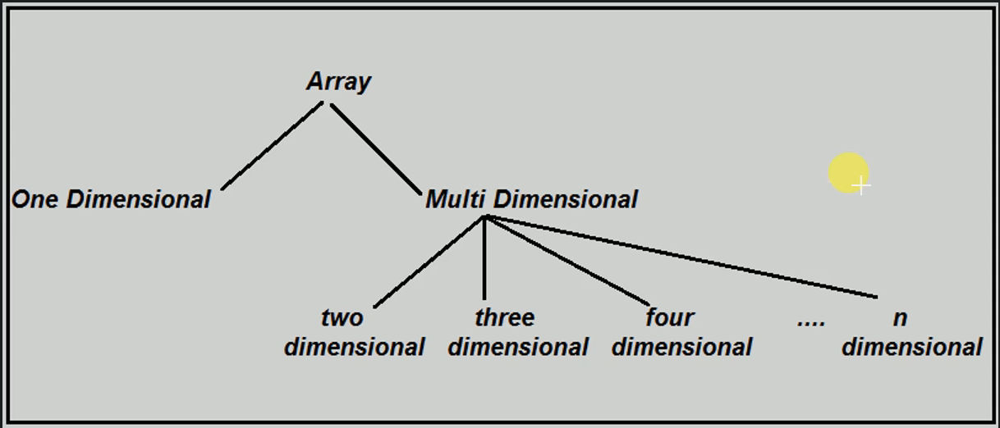

# Properties of an Array

- Array can store data of a specified type (int, long, double, etc...)
- It has a contiguous memory location
- Every 'cell' of an array has a unique 'index'

## Types of arrays

### One dimensional arrat
Elements are stored in consecutive memory locations