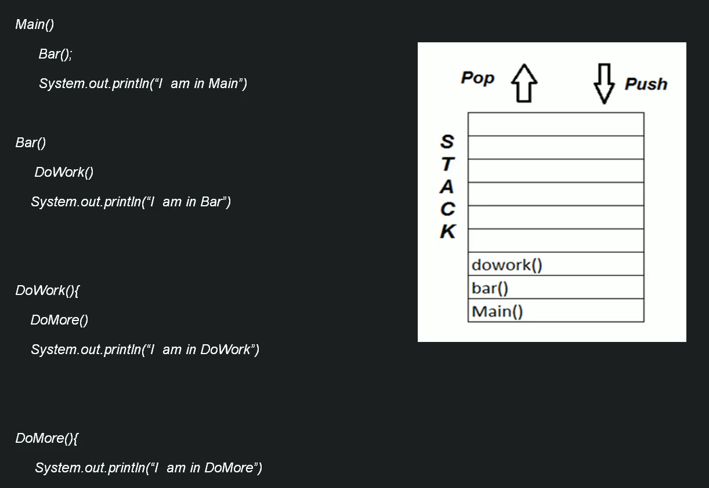
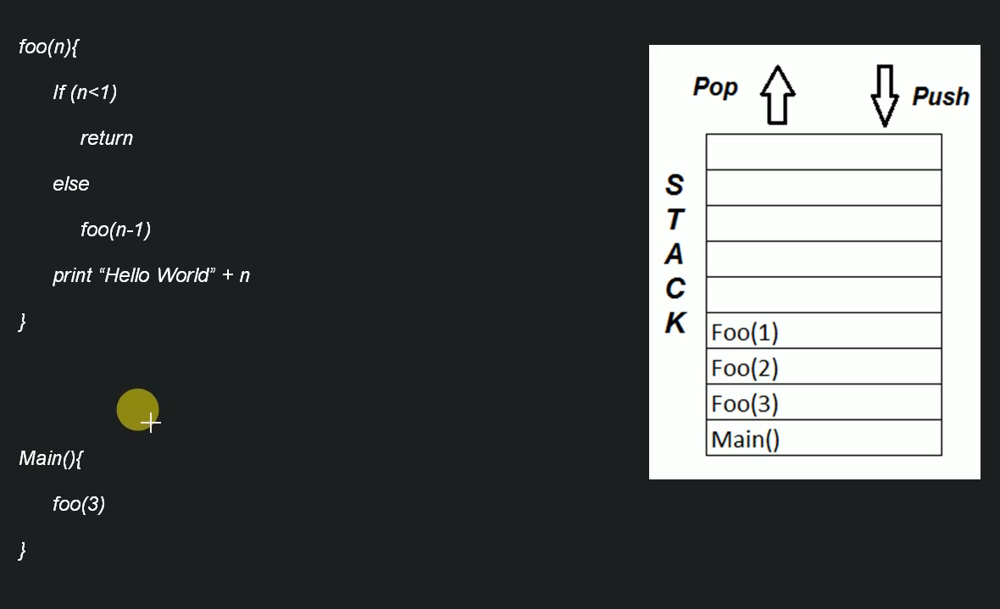
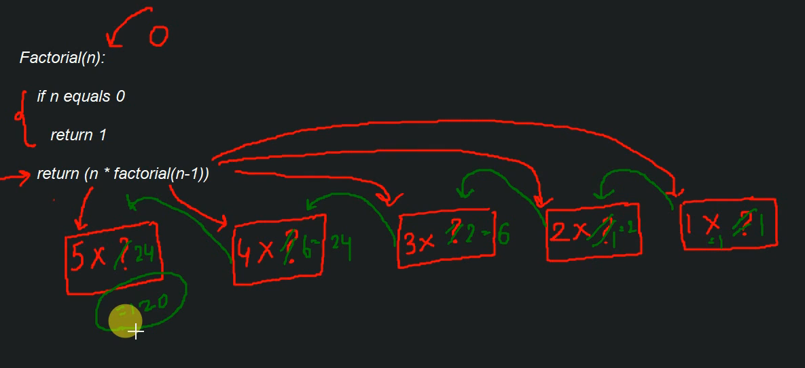
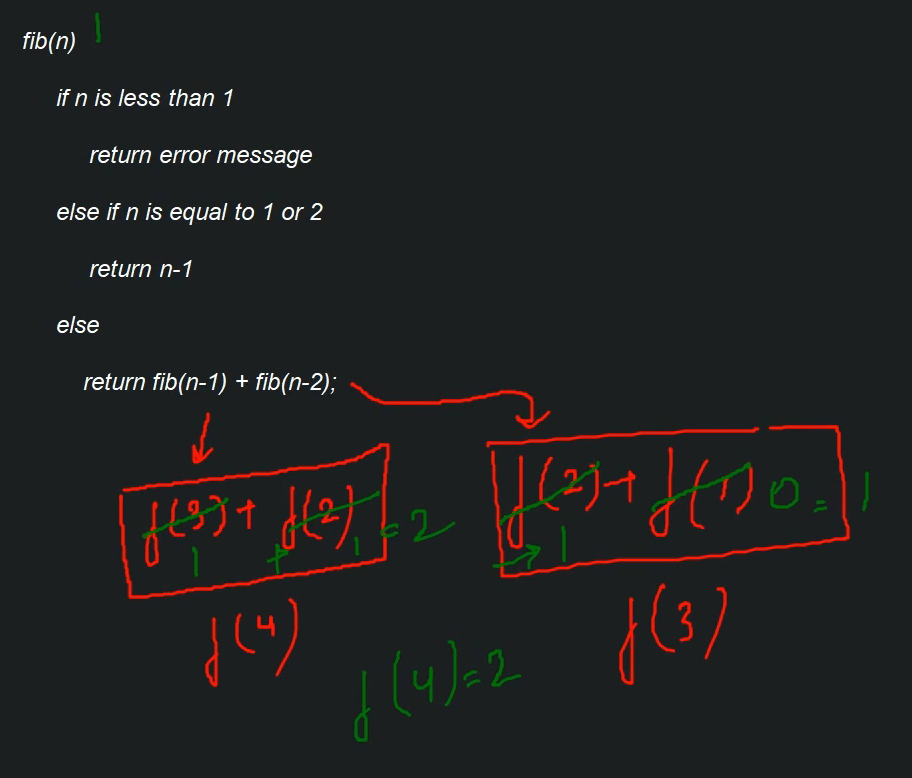
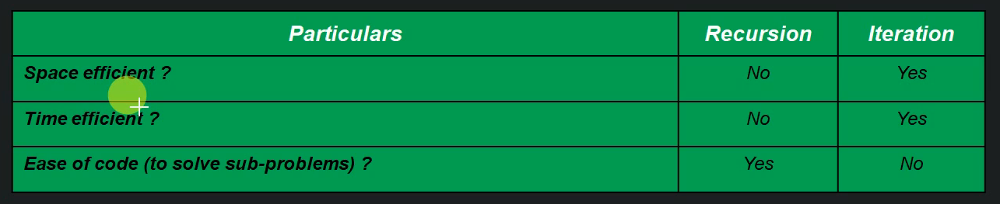

# Recursion

## Properties of recursion

Keep these three things in mind when using recursion:

1. We are performing the same operation multiple times with different inputs
2. In every step we try to make the problem smaller
3. We *must* have a **base-condition** which tells the system to end the recursion

## Why should we use recursion?

1. It makes our code easier to write/understand than an iterative solution
2. It is heavily used with a handful of Data Structures including Trees, and Graphs
3. It is also used in several crucial techniques incouding Divide and Conquer, Greedy Algorithms, Dynamic Programming

## Format of a recursive function

**Recursive Case:** The case were the base case has not yet been rreached so we must call the function again, this isrefeered to as **recurring**

**Base Case:** This is the ultimate goal of recursion, once we reach our base case we have found our desired object/value and are ready to end our recursion

**Example:** 
```
recursionFunc(parameter){
    if(base case is satisfied){
        return some base case value
    } else{
        recursionFunc(modified parameter)
    }
}
```

## How recursion works internally 

### General

Recursion can be explained in the context of a stack, in which we push onto the stack, or pop off the stack in a LIFO methodology



In the graphic we see that **main()** is at the bottom of the stack, this tells our system that no matter what functions are called, we must eventually come back to main() no matter what is executed before hand.

For both **Bar()** and **DoWork()** it is a similar idea to main, in taht we must go back to the parent calling function after the subfunction completes. **DoMore()** does not make it onto the stack becuase it is called and completed, it does not need to be come back to.

**NOTE:** When we pop a method, such as **doWork()** it is because we are in that method, we pop and then execute the method until completion, before popping off the next method

### Recursion

Once **foo(3)** is in the stack we can now call **foo(2)**, notice that **foo(0)** does not make it onto the stack as this is our **base-case** and the function returns once it is called, there is no need to place it on the stack for this reason, it will not be invoked again.



### My explanation

Recursion makes it so the first function we run to completion is the base-case, this is the first function that returns something and tells our system to begin popping off the stack to complete the previous recursive function calls. We work backwards until we are left with just **main()** on the stack, which indicates we have run to completion and we are ready to close out our **main()** execution.

# Examples

## Factorial

Denoted by **n!**, a factorial is a non-negative integer, and is the product of intgers from 1 to n

```java
factorial(n){
    if(n == 0){
        return 1;
    } 
    factorial(n * factorial(n - 1); 
}
```


### My explanation
Before we reach or base case (n == 0) we tell the system, okay, we know the value of **n**, but we don't know the value of **factorial(n-1)** so lets store it on the stack until we calculate the return value.


## Fibonacci Series

A fibonacci sequence is a series in which each number is the sum of the two preceding numbers

```java
fib(n){
    if(n < 1){
        return "Error";
    } else if (n == 1 || n == 2){
        return n - 1;
    } else{
        return fib(n - 2) + fib(n - 1);
    }
}
```



### My explanation
For n equal to any number greater than 2 we will store the function calls on the stack, such as for **n=4**, we would store **fib(2) + fib(3)**, then solve for **n=3**, and repeat until we reach 2, once we reach 2 return 1, decrement **n** again and return (1-1) which is 0. Now we can begin moving backwards as we have found the value for **fib(0) + fib(1)**

## Recursion versus Iteration



**Space efficiency:** Because we require a stack for all recursive calls iteration is preferred as we use a simple loop instead.

**Time efficiency:** It is more time efficient to use a loop than recursion, this is again due to the stack memory being used. Each push + pop operation takes time.

**Ease of code:** Recursion will be simpler to read/understand for yourself and others.

## When to use recursion and when to avoid it

### Use recursion

- When we can breakdown a probloem into a similar sub-problem
- When we are okay with extra overhead (both time and space)
 - Such as for embedded systems
 - Or for critical software, such as SW to launch an airbag in a car,the extra time for recursion would be an issue
- Good for needinig a quick working solution insteead of an efficient one, such as we did with the fibonacci numbers

### Dont use recursion

- If the answer to any of the above statements is **NO**

## Practical uses of recursion

- Stacks
- Tree - Traversal/Search/Insert/Delete
- Sorting - Quicksort, Merge Sort
- Divide and Conquer 
- Dynamic Programming
